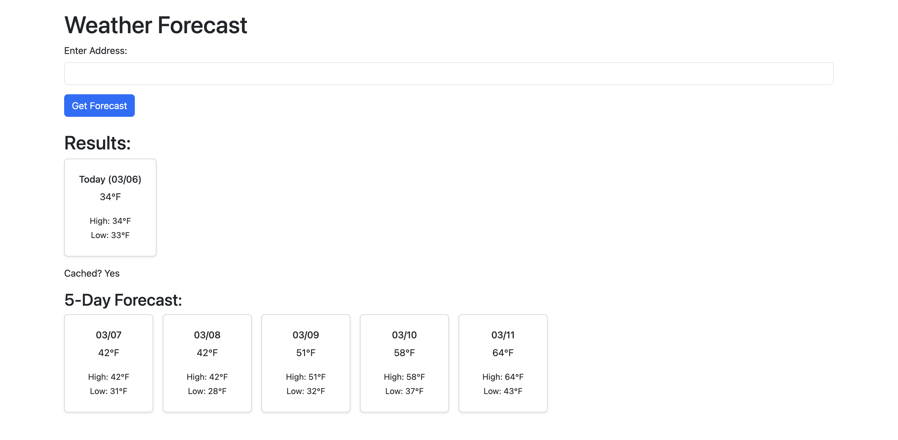

# Weather Service

A Rails 7 application that fetches and displays weather forecasts based on user-provided addresses, with caching and a 5-day extended forecast.

## Features
- Accepts an address (e.g., "Columbus, OH") via a simple form.
- Retrieves current temperature, high/low, and a 5-day forecast using the OpenWeatherMap API.
- Caches weather data by zip code for 30 minutes using Redis, with a cache indicator ("Cached? Yes/No").
- Stores address-to-zip mappings in the database (`ZipLookup` model) to minimize Geocod.io API calls, as zip codes are stable.
- Styled with Bootstrap 5: responsive cards with drop shadows for today’s forecast and 5-day forecast.
- Comprehensive test suite with RSpec, covering weather fetching, caching, and zip lookup logic.

## Screenshot


## Setup

### Prerequisites
- Ruby 3.2.0 (via `asdf` or your preferred version manager)
- Rails 7.2.2.1 (or compatible 7.x version)
- SQLite3 (for local database)
- Redis (for caching, e.g., via `brew install redis` on macOS)
- Geocod.io API key (free tier: 500 lookups/day)
- OpenWeatherMap API key (free tier)

### Installation
1. Clone the repository:
   ```bash
   git clone git@github.com:gharmonjr/weather-service.git
   cd weather-service
   ```
2. Install Ruby 3.2.0 if not already installed (e.g., via asdf):

   ```bash
   asdf install ruby 3.2.0
   asdf local ruby 3.2.0
   ```
3. Install dependencies:
   ```bash
   bundle install
   ```
4. Setup database:
   ```bash
   rails db:migrate
   ```
5. Configure API Keys:
*
   ```bash
   rails credentials:edit
   ```
* ```yaml
   open_weather:
     api_key: YOUR_OPENWEATHERMAP_KEY
   geocodio:
     api_key: YOUR_GEOCODIO_KEY
   ```

## Running the App
   ```bash
   bin/dev
   ```
* Access the app at http://localhost:3000
* Enter an address (e.g., "Columbus, OH") to see the current weather and 5-day forecast.

## Running Tests
   ```bash
   rspec
   ```
* Tests cover WeatherFetcher (weather fetching, caching, expiration) and ZipLookup (address-to-zip mapping, validations).

## Implementation Details
* Address to Zip Code: Uses Geocod.io to convert addresses to zip codes. Stores mappings in the ZipLookup model to avoid unnecessary API calls (zip codes are stable). Includes a uniqueness validation on address to prevent duplicates.
* Weather Fetching: Fetches data from OpenWeatherMap’s /data/2.5/forecast endpoint, providing current temperature, high/low, and a 5-day forecast (daily aggregates).
* Caching: Weather data is cached by zip code in Redis (Rails.cache) for 30 minutes, with a visual indicator of cache usage.
* Styling: Bootstrap 5 with dartsass-sprockets for SCSS processing. Forecast cards use drop shadows (shadow-sm) and flexbox for responsive horizontal layout (d-flex flex-wrap).
* Tests: RSpec suite with 10 passing examples, covering happy paths, edge cases (invalid addresses, API failures), and caching behavior.

## Why Rails 7?
Initially built on Rails 6, but switched to Rails 7 to resolve M2 Mac compatibility issues (e.g., sassc native extensions, Logger errors). Rails 7 provided a smoother setup, allowing focus on functionality. I’m comfortable with Rails 5/6 for production as per the job requirements.

## Decomposition
* ZipLookup Model: Stores unique address-to-zip mappings to reduce Geocod.io API calls.
* WeatherFetcher: Handles weather API calls and caching logic, aggregating daily high/low for the 5-day forecast.
* ForecastsController: Manages the UI flow (form submission, rendering results).
* Views: Styled with Bootstrap cards, showing today’s forecast and a 5-day forecast in a responsive layout.

## Notes
* Includes high/low temps and a 5-day daily forecast for bonus points.
* Uses Geocod.io for reliable zip code lookup (Nominatim lacked postal codes).
* Redis chosen for caching over database for performance; ZipLookup uses SQLite for stable address mappings.


